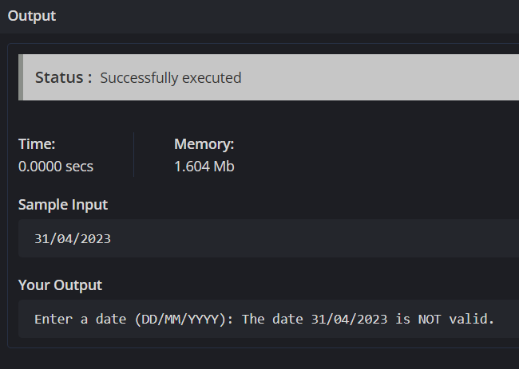
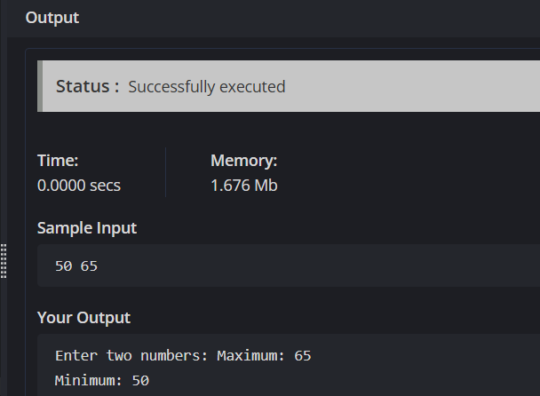
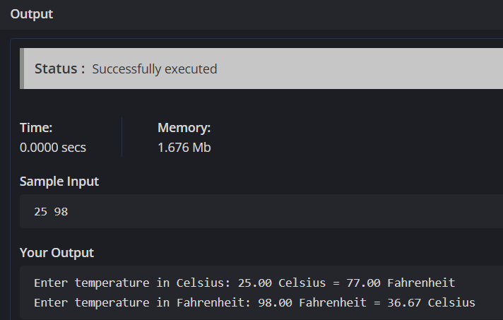
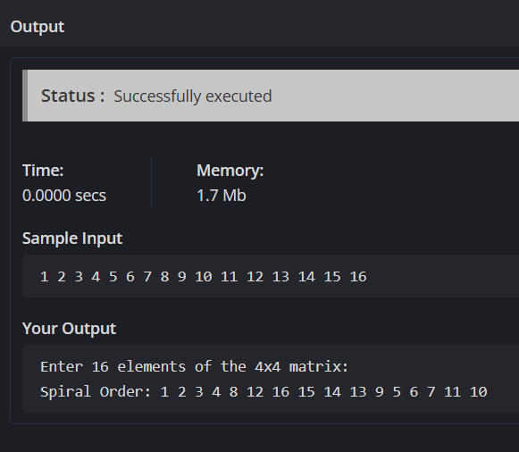
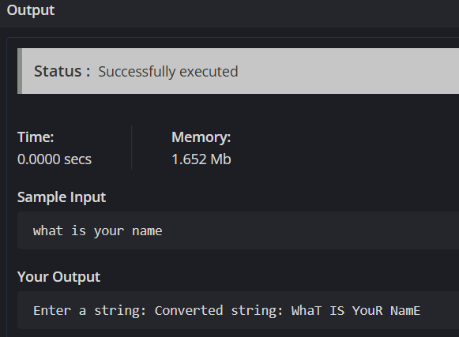

# 19AI304-Fundamentals-of-C-Programming-2025-Odd-M4
# IAPR-4- Module 4 - FoC
## 7. Implementation of Functions.
## 8. Implementation of passing parameters.
# Ex.No:16
  Implement a C program to read a date in the format DD/MM/YYYY and determine whether the entered date is valid. The program should check the correctness of the day, month, and year, including leap year calculations for February.
# Date : 26/02/2026
# Aim:
 To implement a C program that validates a user-entered date using a function without parameters and without return value, ensuring the correctness of day, month, year, and leap year conditions.
# Algorithm:
### Step 1:
  Start
### Step 2: 
  Include the standard input-output library: #include<stdio.h>.
### Step 3:
### Call the function `validateDate()`.
### Inside `validateDate()` function:
### Step 4: 
  Declare variables `dd`, `mm`, and `yy`.
### Step 5: 
  Ask the user to enter a date in `DD/MM/YYYY` format.
### Step 6: 
  Read the date values using `scanf`.
### Step 7: 
  Check if the year is between **1900 and 9999**.
 - If the year is invalid, display **"Year is not valid"** and stop further checks.
### Step 8: 
  Check if the month is between **1 and 12**.
- If the month is invalid, display **"Month is not valid"** and stop further checks.
### Step 9: 
  If the month has **31 days**, check if the day is between **1 and 31**.
### Step 10: 
  If the month has **30 days**, check if the day is between **1 and 30**.
### Step 11: 
  If the month is **February**:
  - Check if the day is between **1 and 28**, or if the day is **29**, verify if it's a **leap year**.
### Step 12: 
  If any valid condition is satisfied, display **"Date is valid."**
### Step 13: 
  Otherwise, display **"Date is invalid."**
### Step 14: 
  Stop
# Program:
```
#include <stdio.h>

// Function to check if a year is a leap year
int isLeapYear(int year) {
    return (year % 4 == 0 && year % 100 != 0) || (year % 400 == 0);
}

// Function to check if a date is valid
int isValidDate(int day, int month, int year) {
    if (year < 1) return 0;      // Year must be positive
    if (month < 1 || month > 12) return 0; // Month must be 1-12

    int daysInMonth;

    switch (month) {
        case 1: case 3: case 5: case 7:
        case 8: case 10: case 12:
            daysInMonth = 31;
            break;
        case 4: case 6: case 9: case 11:
            daysInMonth = 30;
            break;
        case 2:
            daysInMonth = isLeapYear(year) ? 29 : 28;
            break;
        default:
            return 0;
    }

    if (day < 1 || day > daysInMonth) return 0;

    return 1;
}

int main() {
    int day, month, year;

    // Input date from user
    printf("Enter a date (DD/MM/YYYY): ");
    if (scanf("%d/%d/%d", &day, &month, &year) != 3) {
        printf("Invalid input format!\n");
        return 1;
    }

    // Check if date is valid
    if (isValidDate(day, month, year)) {
        printf("The date %02d/%02d/%04d is valid.\n", day, month, year);
    } else {
        printf("The date %02d/%02d/%04d is NOT valid.\n", day, month, year);
    }

    return 0;
}
```
# Output:


# Result: 
Thus, the program was implemented and executed successfully, and the required output was obtained.


# 19AI304-Fundamentals-of-C-Programming-2025-Odd-M4
# IAPR-4- Module 4 - FoC
# Ex.No:17
  Develop a C program to read two numbers from the user and determine the maximum and minimum values. Use user-defined functions with arguments and return values—one function to find the maximum (max()) and another to find the minimum (min()).
# Date : 
# Aim:
 To develop a C program that uses functions with parameters and return values to compute and display the maximum and minimum of two user-entered numbers.
# Algorithm:
### Step 1:
  Start
### Step 2: 
  Include the standard input-output library: #include<stdio.h>.
### Step 3: 
  Declare variables `num1`, `num2`, `maximum`, and `minimum`.
### Step 4: 
  Ask the user to enter two numbers.
### Step 5: 
  Read the numbers using `scanf`.
### Step 6: 
  Call the function `max(num1, num2)`.
### Step 7: 
  Inside function `max(num1, num2)`:
- **Step 7.1:** Receive two integer arguments.  
- **Step 7.2:** Compare the two numbers.  
- **Step 7.3:** If `num1 > num2`, return `num1`.  
- **Step 7.4:** Otherwise, return `num2`.
### Step 8: 
  Store the returned value in `maximum`.
### Step 9: 
  Call the function `min(num1, num2)`.
### Step 10: 
  Inside function `min(num1, num2)`:
- **Step 10.1:** Receive two integer arguments.  
- **Step 10.2:** Compare the two numbers.  
- **Step 10.3:** If `num1 > num2`, return `num2`.  
- **Step 10.4:** Otherwise, return `num1`.
### Step 11: 
  Store the returned value in `minimum`.
### Step 12: 
  Display the returned maximum and minimum values.
### Step 13: 
  Stop
# Program:
```
#include <stdio.h>

// Function to find maximum of two numbers
int max(int a, int b) {
    return (a > b) ? a : b;
}

// Function to find minimum of two numbers
int min(int a, int b) {
    return (a < b) ? a : b;
}

int main() {
    int num1, num2;

    // Input two numbers from user
    printf("Enter two numbers: ");
    scanf("%d %d", &num1, &num2);

    // Call user-defined functions
    int maximum = max(num1, num2);
    int minimum = min(num1, num2);

    // Display results
    printf("Maximum: %d\n", maximum);
    printf("Minimum: %d\n", minimum);

    return 0;
}
```
# Output:

# Result: 
Thus, the program was implemented and executed successfully, and the required output was obtained.


# 19AI304-Fundamentals-of-C-Programming-2025-Odd-M4
# IAPR-4- Module 4 - FoC
# Ex.No:18
  Develop a C program to convert temperatures between Celsius and Fahrenheit: Convert Celsius to Fahrenheit using a function that returns the converted value. Convert Fahrenheit to Celsius using another function that returns the converted value. Display the results in the main() function.
# Date : 
# Aim:
 To develop a C program that converts temperatures between Celsius and Fahrenheit using functions with return values.
# Algorithm:
### Step 1:
  Start
### Step 2: 
  Include the standard input-output library: #include<stdio.h>.  
### Step 3:
 Declare function prototypes:
 - `float celtof();`  
 - `float ftocel();`
### Step 4: 
  Enter the `main()` function.
### Step 5:
  Call the `celtof()` function to convert Celsius to Fahrenheit.
### Step 6: 
  Inside `celtof()` function:
 - Declare float variables `C` and `F`.  
 - Display the message: **"Enter the temperature in Celsius"**.  
 - Read the value of `C` from the user.  
 - Calculate Fahrenheit using the formula: `F = (C * 9 / 5) + 32`.  
 - Return `F` to `main()`.
### Step 7: 
  Print the returned Fahrenheit value in `main()`.
### Step 8: 
  Call the `ftocel()` function to convert Fahrenheit to Celsius.
### Step 9: 
  Inside `ftocel()` function:
 - Declare float variables `f` and `celsius`.  
 - Display the message: **"Enter the temperature in Fahrenheit"**.  
 - Read the value of `f` from the user.  
 - Calculate Celsius using the formula: `celsius = (f - 32) * 5 / 9`.  
 - Return `celsius` to `main()`.
### Step 10: 
 Print the returned Celsius value in `main()`.
### Step 11: 
 Stop
# Program:
```
#include <stdio.h>

// Function to convert Celsius to Fahrenheit
float celsiusToFahrenheit(float celsius) {
    return (celsius * 9.0 / 5.0) + 32;
}

// Function to convert Fahrenheit to Celsius
float fahrenheitToCelsius(float fahrenheit) {
    return (fahrenheit - 32) * 5.0 / 9.0;
}

int main() {
    float celsius, fahrenheit;

    // Input Celsius temperature
    printf("Enter temperature in Celsius: ");
    scanf("%f", &celsius);

    // Convert to Fahrenheit and display
    float tempF = celsiusToFahrenheit(celsius);
    printf("%.2f Celsius = %.2f Fahrenheit\n", celsius, tempF);

    // Input Fahrenheit temperature
    printf("Enter temperature in Fahrenheit: ");
    scanf("%f", &fahrenheit);

    // Convert to Celsius and display
    float tempC = fahrenheitToCelsius(fahrenheit);
    printf("%.2f Fahrenheit = %.2f Celsius\n", fahrenheit, tempC);

    return 0;
}
```
# Output:


# Result: 
Thus, the program was implemented and executed successfully, and the required output was obtained.

 
# 19AI304-Fundamentals-of-C-Programming-2025-Odd-M4
# IAPR-4- Module 4 - FoC
# Ex.No:19
  Build a C program to print the elements of a given 4×4 matrix in spiral order starting from the top-left element and moving clockwise,using a user-defined parameterized function without return spiralPrint().
# Date : 
# Aim:
 To build a C program to display the elements of a 2D array in spiral form, traversing the outer elements first and then moving inward in a clockwise direction, using a user-defined parameterized function without return spiralPrint().
# Algorithm:
### Step 1:
  Start
### Step 2: 
  Include the standard input-output library: #include<stdio.h>.  
### Step 3: 
  Define constants `R` and `C` for the number of rows and columns in the matrix.
### Step 4: 
  Declare a function `spiralPrint(int m, int n, int a[R][C])` to print the matrix in spiral order.
### Step 5: 
  Inside `spiralPrint()` function:
 - Initialize variables:  
   - `k = 0` → starting row index  
   - `l = 0` → starting column index  
   - `m` → ending row index  
   - `n` → ending column index  
 - Repeat the following while `k < m` and `l < n`:
   - a. **Print the top row from left to right**:  
     - Loop from column `l` to `n-1` and print `a[k][i]`.  
     - Increment `k`.       
   - b. **Print the last column from top to bottom**:  
     - Loop from row `k` to `m-1` and print `a[i][n-1]`.  
     - Decrement `n`.       
   - c. **If `k < m`, print the bottom row from right to left**:  
     - Loop from column `n-1` to `l` and print `a[m-1][i]`.  
     - Decrement `m`.       
   - d. **If `l < n`, print the first column from bottom to top**:  
     - Loop from row `m-1` to `k` and print `a[i][l]`.  
     - Increment `l`.
### Step 6: 
  In the `main()` function:
- Declare and initialize a 4×4 matrix `a`.  
- Call `spiralPrint(R, C, a)` to print the elements in spiral order.
### Step 7: 
  Stop
# Program:
```
#include <stdio.h>

#define SIZE 4

// Function to print matrix in spiral order
void spiralPrint(int matrix[SIZE][SIZE]) {
    int i, rowStart = 0, rowEnd = SIZE - 1;
    int colStart = 0, colEnd = SIZE - 1;

    printf("Spiral Order: ");
    
    while (rowStart <= rowEnd && colStart <= colEnd) {
        // Print top row
        for (i = colStart; i <= colEnd; i++)
            printf("%d ", matrix[rowStart][i]);
        rowStart++;

        // Print right column
        for (i = rowStart; i <= rowEnd; i++)
            printf("%d ", matrix[i][colEnd]);
        colEnd--;

        // Print bottom row (if any)
        if (rowStart <= rowEnd) {
            for (i = colEnd; i >= colStart; i--)
                printf("%d ", matrix[rowEnd][i]);
            rowEnd--;
        }

        // Print left column (if any)
        if (colStart <= colEnd) {
            for (i = rowEnd; i >= rowStart; i--)
                printf("%d ", matrix[i][colStart]);
            colStart++;
        }
    }
    printf("\n");
}

int main() {
    int matrix[SIZE][SIZE];
    int i, j;

    // Input 4x4 matrix
    printf("Enter 16 elements of the 4x4 matrix:\n");
    for (i = 0; i < SIZE; i++) {
        for (j = 0; j < SIZE; j++) {
            scanf("%d", &matrix[i][j]);
        }
    }

    // Call function to print spiral order
    spiralPrint(matrix);

    return 0;
}
```
# Output:


# Result: 
Thus, the program was implemented and executed successfully, and the required output was obtained.


# 19AI304-Fundamentals-of-C-Programming-2025-Odd-M4
# IAPR-4- Module 4 - FoC
# Ex.No:20
  Build a C program to convert a string such that the first and last characters, as well as the characters before and after each space, are converted to uppercase. Implement this using a user-defined parameterized function without return.
# Date : 
# Aim:
To build a C program to convert a string as described above, using a user-defined parameterized function without return convertFirstCLastC(char str[]).
# Algorithm:
### Step 1:
  Start
### Step 2: 
  Include the standard input-output library: #include<stdio.h>.  
### Step 3: 
  Declare a user-defined void function `convertFirstCLastC(char str[])` that takes the string as a parameter.
### Step 4: 
 Inside `convertFirstCLastC(char str[])` function:
 - Find the length of the string `len`.  
 - Convert the first character `str[0]` to uppercase.  
 - Loop through the string from index `1` to `len-2`:  
   - If a character is a space, capitalize the character before and after it.  
 - Convert the last character `str[len-1]` to uppercase.
### Step 5: 
 In `main()` function:
 - Declare a string `str[100]`.  
 - Read the input string from the user.  
 - Call the function `convertFirstCLastC(char str[])`.  
 - Print the modified string.
### Step 6: 
 Stop
# Program:
```
#include <stdio.h>
#include <ctype.h>
#include <string.h>

// Function to convert string as per rules
void convertString(char str[]) {
    int len = strlen(str);

    if (len == 0) return;

    // Convert first character to uppercase
    str[0] = toupper(str[0]);

    // Convert last character to uppercase
    str[len - 1] = toupper(str[len - 1]);

    // Convert characters before and after each space
    for (int i = 0; i < len; i++) {
        if (str[i] == ' ') {
            if (i > 0) str[i - 1] = toupper(str[i - 1]); // before space
            if (i < len - 1) str[i + 1] = toupper(str[i + 1]); // after space
        }
    }
}

int main() {
    char str[1000];

    // Input string
    printf("Enter a string: ");
    fgets(str, sizeof(str), stdin);

    // Remove newline if present
    int len = strlen(str);
    if (str[len - 1] == '\n') {
        str[len - 1] = '\0';
    }

    // Convert string using user-defined function
    convertString(str);

    // Display converted string
    printf("Converted string: %s\n", str);

    return 0;
}
```
# Output:


# Result: 
Thus, the program was implemented and executed successfully, and the required output was obtained.

